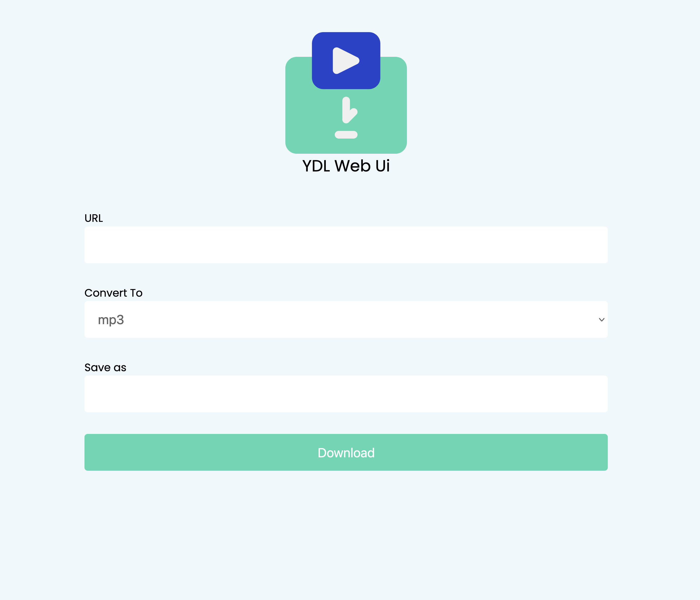

# Web Youtube-DL

This is simple web interface to the youtube-dl command line program that also acts as a conversion service.
This application is build using C++ Wt library, this is to allow faster performance in converting media files by leveraging the 
power of modern C++.